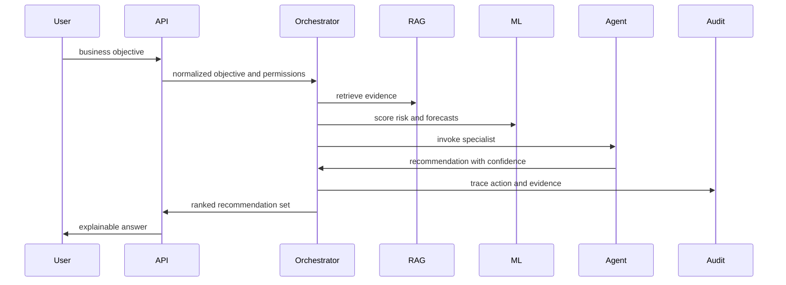

# Agent Communication

```mermaid
sequenceDiagram
  participant User
  participant API
  participant Orchestrator
  participant RAG
  participant ML
  participant Agent
  participant Audit
  User->>API: business objective
  API->>Orchestrator: normalized objective and permissions
  Orchestrator->>RAG: retrieve evidence
  Orchestrator->>ML: score risk and forecasts
  Orchestrator->>Agent: invoke specialist
  Agent->>Orchestrator: recommendation with confidence
  Orchestrator->>Audit: trace action and evidence
  Orchestrator->>API: ranked recommendation set
  API->>User: explainable answer
```

Specialists:

- Support Agent
- Maintenance Agent
- Inventory Agent
- Contract Intelligence Agent
- Customer Success Agent
- Compliance Agent
- Executive Advisor Agent

