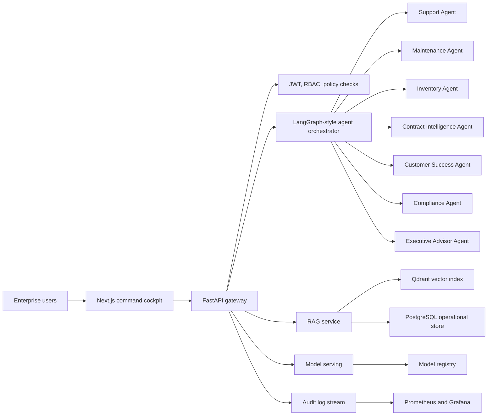

# Production Architecture

## Services

- Frontend: Next.js, TypeScript, Tailwind-compatible design layer
- API gateway: FastAPI with OpenAPI docs
- Persistence: PostgreSQL for operational records, Qdrant for vectors
- ML serving: failure prediction, churn prediction, inventory forecasting, ticket classification, anomaly detection
- Agent orchestration: specialist agents coordinated through a permission-aware orchestrator
- Observability: audit stream, metrics, model confidence, workflow traces

## Production Notes

- All recommendations must include confidence, reasoning, sources, risks, and alternatives.
- RAG retrieval is permission filtered before answer generation.
- Agent actions are gated by role permissions and audited.
- Human review can be inserted for high financial, safety, or compliance risk actions.

