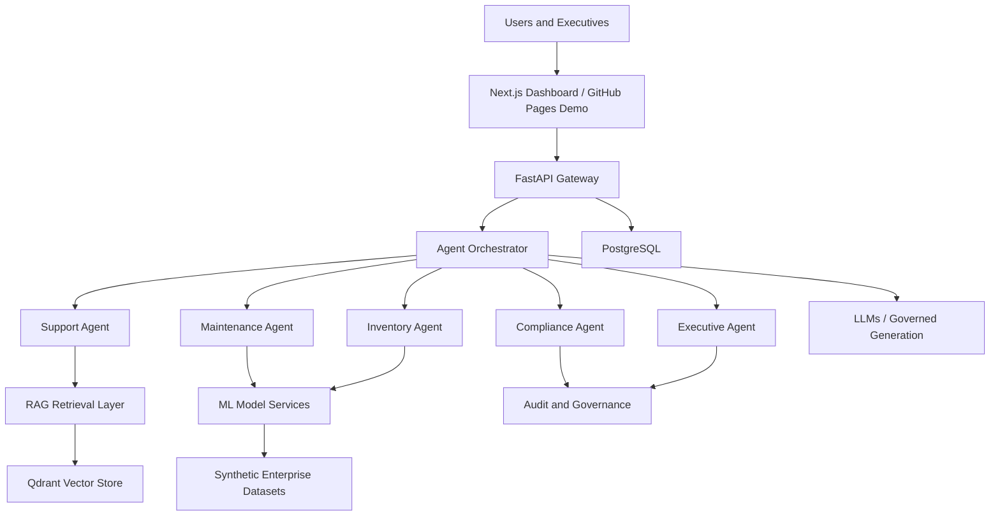
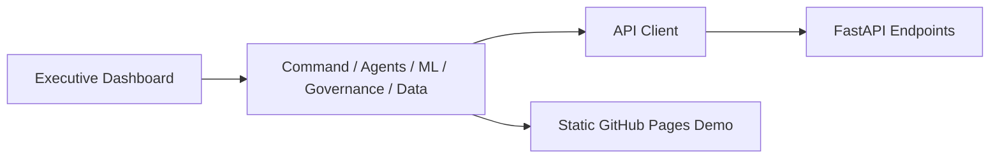
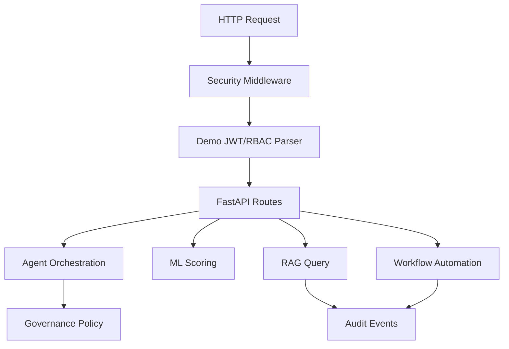
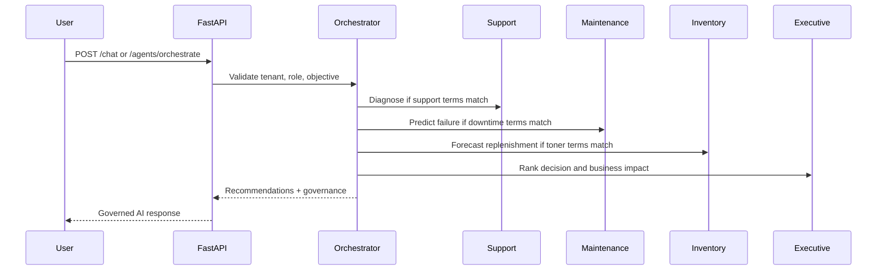
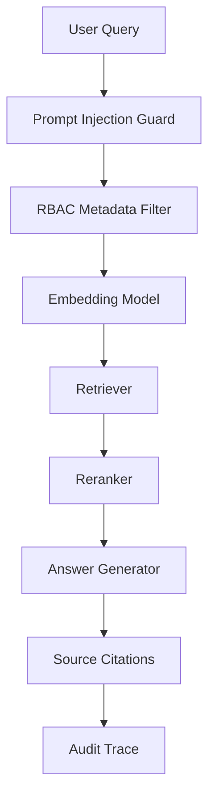

# XEIP System Architecture

## High-Level Architecture

## Frontend Architecture

The current public demo is a self-contained browser application in `docs/index.html`.
The productized app source is in `frontend/app`.

## Backend Architecture

## Agent Architecture

## RAG Architecture

The runnable RAG component layout is:

- `rag/embeddings.py`
- `rag/retriever.py`
- `rag/reranker.py`
- `rag/generator.py`
- `data/manuals`, `data/contracts`, `data/sop`, `data/tickets`

## Database Schema

The PostgreSQL schema is in `database/schema.sql` and covers tenants, devices,
telemetry, tickets, contracts, and audit events.

## API Design

Primary endpoints:

- `GET /health`
- `GET /metrics/executive`
- `POST /chat`
- `POST /agents/orchestrate`
- `POST /rag/query`
- `POST /predict-failure`
- `POST /predict-churn`
- `POST /forecast-toner`
- `POST /route-ticket`
- `POST /detect-anomaly`
- `POST /create-workorder`
- `POST /analyze-contract`
- `POST /workflows/low-toner`
- `GET /data-quality`

