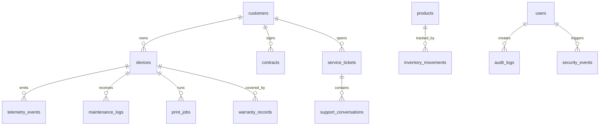

# Database Schema

Core tables:

- `customers(customer_id, name, industry, region, fleet_size, annual_contract_value, churn_probability)`
- `devices(device_id, customer_id, model, region, install_date, status)`
- `telemetry_events(event_id, device_id, timestamp, temperature_c, usage_count, toner_level_pct, error_frequency, anomaly_flag)`
- `maintenance_logs(maintenance_id, device_id, timestamp, type, parts_replaced, downtime_minutes, cost_usd)`
- `service_tickets(ticket_id, customer_id, device_id, opened_at, category, priority, sentiment, sla_met)`
- `contracts(contract_id, customer_id, effective_date, term_months, sla_uptime_pct, response_time_hours, monthly_value_usd)`
- `documents(document_id, source_type, uri, security_label, customer_id, checksum)`
- `chunks(chunk_id, document_id, text, embedding_id, token_count, security_label)`
- `agent_runs(run_id, agent_name, objective, user_id, started_at, status, confidence, trace_json)`
- `audit_logs(audit_id, actor_id, timestamp, control, resource, result, risk_score, evidence_uri)`

