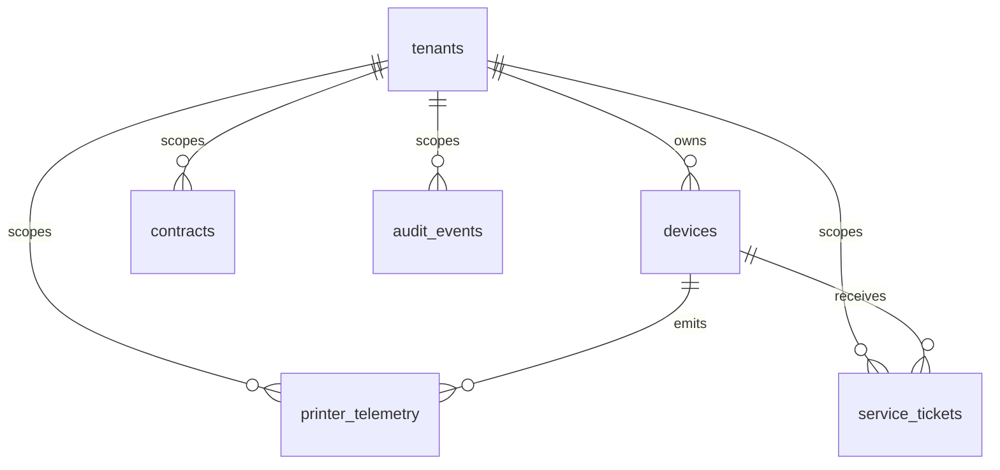

# Database Schema

`database/schema.sql` creates:

- `tenants`
- `devices`
- `printer_telemetry`
- `service_tickets`
- `contracts`
- `audit_events`

The schema is loaded automatically by `docker-compose.yml` when PostgreSQL starts.

