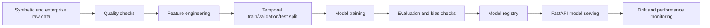

# ML Training Pipelines

Models:

- Printer failure prediction: logistic baseline, XGBoost production candidate
- Customer churn prediction: gradient boosted classifier
- Inventory forecasting: rolling baseline, Prophet/XGBoost candidate
- Ticket classification: TF-IDF baseline, transformer candidate
- Anomaly detection: isolation forest and rules hybrid

Metrics:

- Failure and churn: ROC-AUC, PR-AUC, calibration
- Inventory: MAPE, WAPE, stockout reduction
- Ticket classification: macro F1, escalation precision
- Anomaly: alert precision, time to detect

