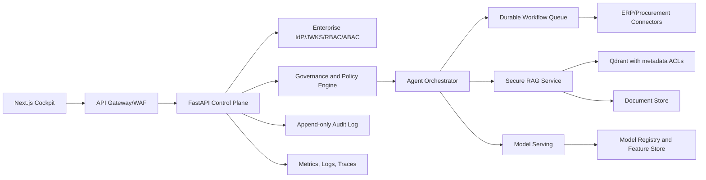

# Principal Engineer Review and Enterprise Redesign

## Executive Finding

The original XEIP scaffold was useful as a demo, but it was not production-grade. It lacked authenticated deny-by-default access, tenant isolation, governed autonomy, auditable agent execution, reliable RAG evidence handling, model governance, data-quality gates, deployment hardening, and operational controls. The remediated design upgrades the platform into a Fortune 500-style reference architecture with explicit risk gates, typed contracts, observability, security controls, and production deployment patterns.

## Gap Analysis

| Area | Original Weakness | Enterprise Risk | Implemented Fix |
| --- | --- | --- | --- |
| Architecture | Monolithic demo functions with no control plane | Hard to scale, govern, or isolate failures | Added governance, schemas, observability, data quality, and documented service boundaries |
| Scalability | In-memory KB, synchronous orchestration, no backpressure | Latency spikes and cascading failures | Added rate limiting, stateless API contract, Kubernetes HPA, resources, probes |
| Security | Missing auth defaulted to executive | Privilege escalation by omission | Auth is required; RBAC and tenant scope enforced |
| Security | No security headers | Browser/content abuse risk | Added CSP, frame, referrer, and nosniff headers |
| Security | Workflow could submit procurement without approval | Financial loss or policy breach | Added approval thresholds, business impact gates, audit trail |
| Tenant Isolation | No tenant model | Cross-customer data leakage | Added tenant ID to user and governance envelope |
| Agent Failure Modes | Heuristic routing with unbounded action | Wrong agent/action executes with overconfidence | Added typed objective, guarded failure modes, approval policy, permissions |
| Hallucination Risk | RAG answered from fallback docs when no evidence matched | Unsupported answers presented confidently | Added abstention when no permission-filtered evidence exists |
| RAG Weakness | No metadata security filter | Restricted sources could leak | Added required permission and classification filters |
| RAG Weakness | No citation integrity or injection audit | Unsafe prompt or fabricated evidence risk | Added injection gating, cited source list, audit events |
| ML Weakness | Unvalidated dict inputs | Invalid feature values and silent scoring errors | Added Pydantic feature bounds for each model |
| ML Weakness | No model cards or drift context | Outputs appear more mature than they are | Added model card, drift score, intended use, limits, monitoring fields |
| Data Quality | Synthetic data quality was undocumented | Training on noisy demo data could mislead | Added `/data-quality` profiling endpoint and training gate |
| Deployment | Container ran as root, mutable FS, `latest` image | Supply chain and runtime risk | Added non-root user, read-only FS, dropped capabilities, pinned image tag |
| Kubernetes | No resources, HPA, PDB, liveness, network policy | Unreliable production behavior | Added resource limits, HPA, PDB, probes, NetworkPolicy |
| Operations | No audit event structure | Weak incident response and compliance evidence | Added in-memory audit event model for demo; docs call for append-only production store |
| Business | Demo claims could overstate readiness | Executive trust and procurement risk | Added limitations, approval controls, model cards, and explicit synthetic-data caveats |

## Enterprise Target Architecture

## Required Production Controls

- Replace demo token parser with real OIDC/JWKS validation and ABAC.
- Move audit events from process memory to immutable storage.
- Use durable orchestration for long-running agent actions.
- Add feature store, model registry, champion/challenger rollout, and rollback.
- Add offline and online evals for RAG, including answer faithfulness, context precision, and citation recall.
- Add kill switches for every autonomous workflow.
- Add customer data partitions, row-level security, encryption, and DLP scanning.
- Add incident runbooks, SLOs, error budgets, and change-management gates.

