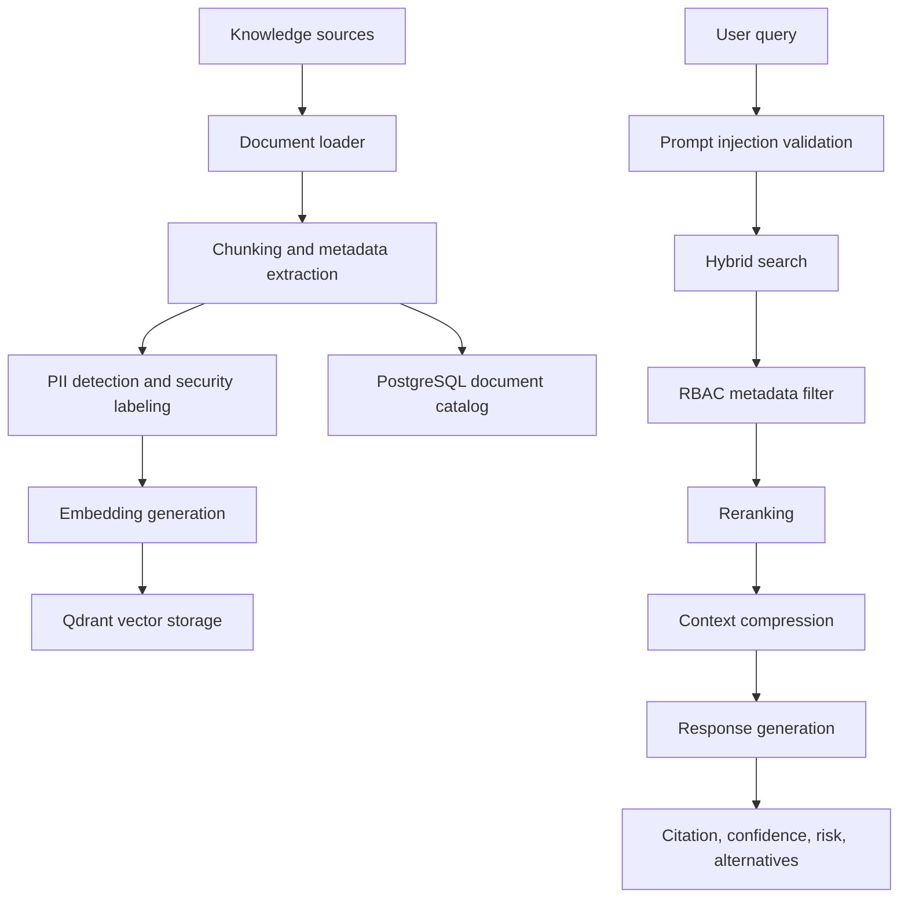

# RAG Pipeline

Knowledge sources include product manuals, SOPs, maintenance guides, historical support tickets, contracts, compliance policies, security procedures, product specifications, training documents, and service engineering notes.

